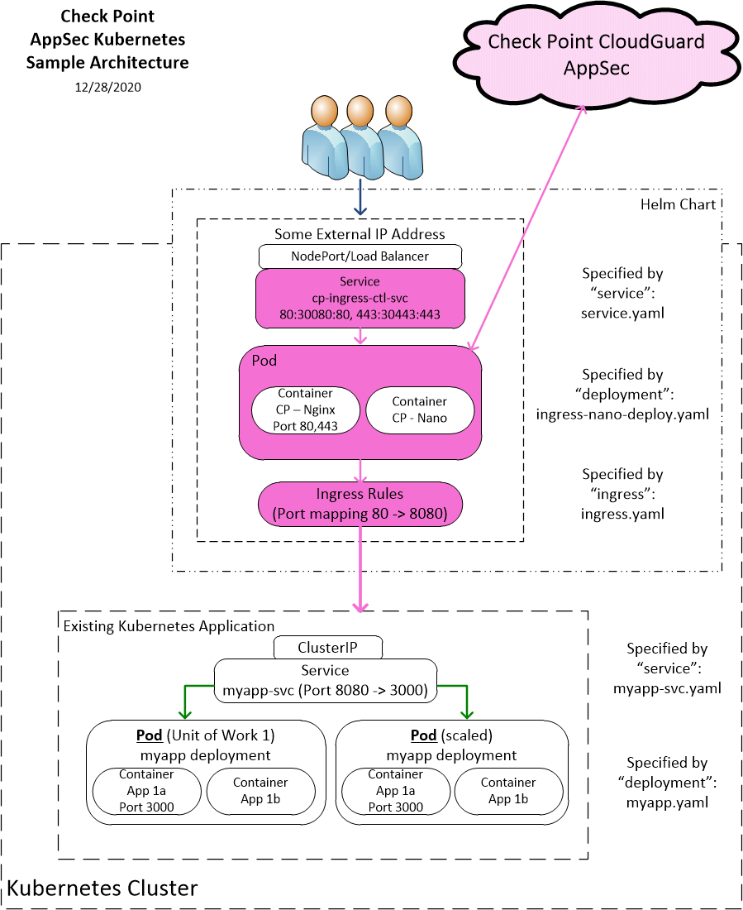

# Check Point CloudGuard AppSec for AKS
## Overview
Check Point CloudGuard AppSec delivers access control, and advanced, multi-layered threat prevention including Web and API protection for mission-critical assets.

Helm charts provide the ability to deploy a collection of kubernetes services and containers with a single command. This helm chart deploys an Nginx-based (1.19) ingress controller integrated with the Check Point container images that include and Nginx Reverse Proxy container integrated with the Check Point CloudGuard AppSec nano agent container. It is designed to run in front of your existing Kubernetes Application. If you want to integrate the Check Point CloudGuard AppSec nano agent with an ingress controller other than nginx, follow the instructions in the CloudGuard AppSec installation guide. Another option would be to download the helm chart and modify the parameters to match your Kubernetes/Application environment.

## Architecture
**NOTE:** The following diagram shows a sample architecture with the application (optionally) exposed externally, using an Ingress and TLS configuration. The steps to enable the Ingress resource are in the sections below.


The following table lists the configurable parameters of this chart and their default values.

| Parameter                                                  | Description                                                     | Default                                          |
| ---------------------------------------------------------- | --------------------------------------------------------------- | ------------------------------------------------ |
| `nanoToken`                                           | Check Point AppSec nanoToken from the CloudGuard Portal(required)                             | `034f3d-96093mf-3k43li... `                                          |
| `appURL`                                           | URL of the application (must resolve to cluster IP address after deployment,required)     | `myapp.mycompany.com`                                          |
| `mysvcname`                                           | K8s service name of your application(required)     | `myapp`                         |
| `mysvcport`                                           | K8s listening port of your service(required)     | `8080`                         |
| `myNodePort`                                           | Host Node Port used for inbound ingress     | `30080`                         |
| `mySSLNodePort`                                        |  Host Node Port used for SSL inbound ingress)     | `30443`                         |
| `platform`                                        |  Deployment Platform (EKS, AKS, GKE, private)     | `private`                         |
| `image.cpappsecnginxingress.properties.imageRepo`                                             | Dockerhub location of the nginx image integrated with Check Point AppSec                     | `checkpoint/infinity-next-nginx-ingress`                                              |
| `image.cpappsecnginxingress.properties.imageTag`                                             | Image Version to use                    | `1.0.2`                                              |
| `image.cpappsecnanoagent.properties.imageRepo`                                              | Dockerhub location of the Check Point nano agent image              | `checkpoint/infinity-next-nano-agent`                                           |
| `image.cpappsecnanoagent.properties.imageTag`                                              | Version to use              | `1.0.2`                                           |
| `TLS_CERTIFICATE_CRT`                                           | Default TLS Certificate               | `Certificate string`                         |
| `TLS_CERTIFICATE_KEY`                                           | Default TLS Certificate Key               | `Certificate Key string`                         | 

# Installation

## Command line instructions

You can use [Azure Cloud Shell](https://shell.azure.com/#cloudshell/) or a local workstation to follow the steps below.

### Prerequisites
#### Configure your application in the [Check Point Infinity Next AppSec Portal](https://portal.checkpoint.com) 
Define the application you want to protect in the “Infinity Next AppSec” application of the Check Point Infinity Next AppSec Portal according to the CloudGuard AppSec Deployment Guide section on AppSec Management. [CP CloudGuard AppSec Admin Guide](https://github.com/CheckPointSW/Infinity-Next/blob/main/marketplace/gke/resources/CP_CloudGuard_AppSec_AdminGuide.pdf)

Once the application has been configured in the CloudGuard AppSec Portal, retrieve the value for the nanoToken to be used in a later step.

#### Set up command-line tools
You'll need the following tools in your development environment. If you are using Cloud Shell, `az`, `kubectl`, Docker, and Git are installed in your environment by default.

-   [kubectl](https://kubernetes.io/docs/reference/kubectl/overview/)
-   [git](https://git-scm.com/book/en/v2/Getting-Started-Installing-Git)
-   [openssl](https://www.openssl.org/)
-   [helm](https://helm.sh/)


### Provision an Azure Kubernetes Cluster with AKS

The quickest way to setup a Kubernetes cluster is with `az`, the [Microsoft Azure command-line interface](https://cloud.google.com/container-engine/). If you don't have `az`, [install it using these instructions](https://docs.microsoft.com/en-us/cli/azure/install-azure-cli) or use the Azure Portal Console.

Follow the steps below to provision a Kubernetes Cluster with AKS. 

```bash
az login
az account set --subscription "SUBSCRIPTION-NAME"
az group create --name aks-resource-group --location eastus
az aks create --name aks-cluster --resource-group aks-resource-group --generate-ssh-keys
```
The above command creates a new resource group and cluster named `aks-cluster`. Then, install and configure `kubectl` with the credentials to the new AKS cluster, as shown below:

```bash
az aks get-credentials --name aks-cluster --resource-group aks-resource-group
```

#### (Optional) Create a namespace in your Kubernetes cluster
If you use a different namespace than `default`, or the namespace does not exist
yet, run the command below to create a new namespace:

```shell
kubectl create namespace "$NAMESPACE"
```
### Add the Helm repository
Helm charts are available via the Azure Marketplace public repository.

Create a secret to use when pulling images from the registry. This step is only necessary the first time you deploy a chart on an AKS cluster, and can safely be omitted for subsequent chart deployments on the same cluster.

```bash
$ kubectl create secret generic emptysecret --from-literal=.dockerconfigjson='{"auths":{"marketplace.azurecr.io":{"Username":"","Password":""}}}' --type=kubernetes.io/dockerconfigjson
```

#### Add the Azure Marketplace repository:

```bash
helm repo add azure-marketplace https://marketplace.azurecr.io/helm/v1/repo
helm search repo azure-marketplace
```
### Install the Application

```shell
helm install my-release azure-marketplace/cpappsec --namespace="myns" --set nanoToken="4339fab-..." --set appURL="{your App URL}" --set mysvcname="{your App Name}" --set mysvcport="{your App Service Port}" 
```

### Open your Application site
Get the external IP of your Application site using the following command:

```
SERVICE_IP=$(kubectl get ingress $APP_INSTANCE_NAME-cp-ingress-ctl-svc \
  --namespace $NAMESPACE \
  --output jsonpath='{.status.loadBalancer.ingress[0].ip}')

echo "https://${SERVICE_IP}/"
```
The command shows you the URL for inbound traffic to your site through the Check Point AppSec Ingress Controller.

After the Ingress Controller container creation is finished, the Check Point Agent will register in the Check Point Infinity Next portal and your application will be protected based on the policy you define there.

# Uninstall the Application

## Using the Azure Cloud Platform Console

1.  In the Azure Portal, select your Kubernetes Cluster from
    [Kubernetes Services](https://portal.azure.com/#blade/HubsExtension/BrowseResource/resourceType/Microsoft.ContainerService%2FmanagedClusters).

1.  From the list of applications, select "Workloads" from Kubernetes Resources.

1.  Select **cpappsec** and  click **Delete**.

## Using the command line

```
helm delete cpappsec
```


