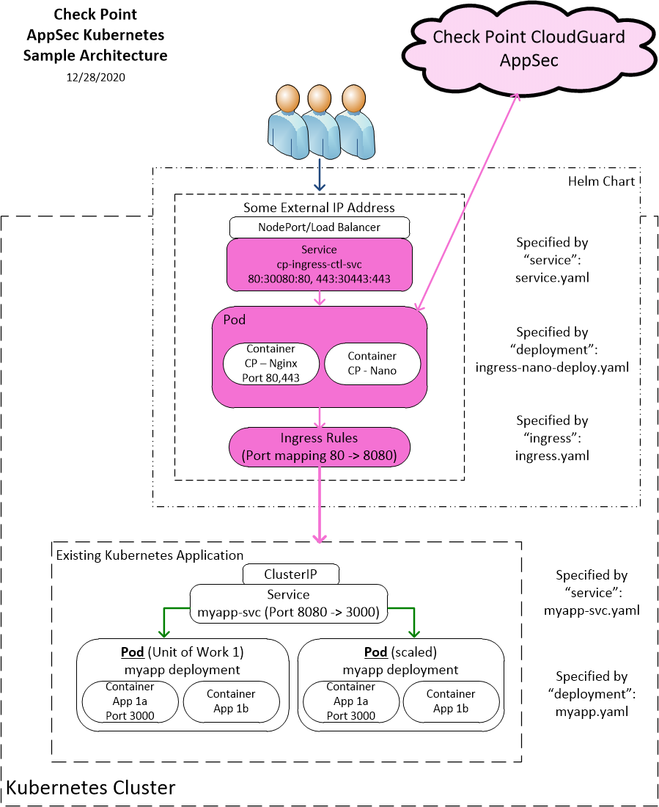

# Check Point CloudGuard AppSec
## Overview
Check Point CloudGuard AppSec delivers access control and advanced threat prevention including web and api protection for mission-critical assets.  Check Point CloudGuard AppSec delivers advanced, multi-layered threat prevention to protect customer assets in Kubernetes clusters from web attacks and sophisticated threats based on Contextual AI.

Helm charts provide the ability to deploy a collection of kubernetes services and containers with a single command. This helm chart deploys an Nginx-based (1.19) ingress controller integrated with the Check Point container images that include and Nginx Reverse Proxy container integrated with the Check Point CloudGuard AppSec nano agent container. It is designed to run in front of your existing Kubernetes Application. If you want to integrate the Check Point CloudGuard AppSec nano agent with an ingress controller other than nginx, follow the instructions in the CloudGuard AppSec installation guide. Another option would be to download the helm chart and modify the parameters to match your Kubernetes/Application environment.

## Architecture
**NOTE:** The following diagram shows a sample architecture with the application (optionally) exposed externally, using an Ingress and TLS configuration. The steps to enable the Ingress resource are in the sections below.


The following table lists the configurable parameters of this chart and their default values.

| Parameter                                                  | Description                                                     | Default                                          |
| ---------------------------------------------------------- | --------------------------------------------------------------- | ------------------------------------------------ |
| `nanoToken`                                           | Check Point AppSec nanoToken from the CloudGuard Portal(required)                             | `034f3d-96093mf-3k43li... `                                          |
| `appURL`                                           | URL of the application (must resolve to cluster IP address after deployment,required)     | `myapp.mycompany.com`                                          |
| `mysvcname`                                           | K8s service name of your application(required)     | `myapp`                         |
| `mysvcport`                                           | K8s listening port of your service(required)     | `8080`                         |
| `cpappsecnginxingress.properties.imageRepo`                                             | Dockerhub location of the nginx image integrated with Check Point AppSec                     | `checkpoint/infinity-next-nginx`                                              |
| `cpappsecnginxingress.properties.imageTag`                                             | Image Version to use                    | `0.1.148370`                                              |
| `cpappsecnanoagent.properties.imageRepo`                                              | Dockerhub location of the Check Point nano agent image              | `checkpoint/infinity-next-nano-agent`                                           |
| `cpappsecnanoagent.properties.imageTag`                                              | Version to use              | `0.1.148370`                                           |
| `TLS_CERTIFICATE_CRT`                                           | Default TLS Certificate               | `Certificate string`                         |
| `TLS_CERTIFICATE_KEY`                                           | Default TLS Certificate Key               | `Certificate Key string`                         | 

# Installation

## Quick install with Google Cloud Marketplace

Get up and running with a few clicks! Install this Check Point AppSec Kubernetes app to a Google
Kubernetes Engine cluster using Google Cloud Marketplace. Follow the
[on-screen instructions](https://console.cloud.google.com/marketplace/details/google/cpappsec).

## Command line instructions

You can use [Google Cloud Shell](https://cloud.google.com/shell/) or a local workstation to follow the steps below.

[](https://console.cloud.google.com/cloudshell/editor?cloudshell_git_repo=https://github.com/GoogleCloudPlatform/click-to-deploy&cloudshell_open_in_editor=README.md&cloudshell_working_dir=k8s/cpappsec)

### Prerequisites
#### Configure your application in the [Check Point CloudGuard AppSec Portal](https://portal.checkpoint.com) 
Define your application in the “CloudGuard AppSec” application of the Check Point CloudGuard AppSec Portal according to the CloudGuard AppSec Deployment Guide section on AppSec Management. [CP CloudGuard AppSec Admin Guide](https://github.com/chkp-mnichols/cpappsec/blob/main/resources/CP_CloudGuard_AppSec_AdminGuide.pdf)

Once the application has been configured in the CloudGuard AppSec Portal, retrieve the value for the nanoToken to be used in a later step.

#### Set up command-line tools
You'll need the following tools in your development environment. If you are using Cloud Shell, `gcloud`, `kubectl`, Docker, and Git are installed in your environment by default.
-   [gcloud](https://cloud.google.com/sdk/gcloud/)
-   [kubectl](https://kubernetes.io/docs/reference/kubectl/overview/)
-   [git](https://git-scm.com/book/en/v2/Getting-Started-Installing-Git)
-   [openssl](https://www.openssl.org/)
-   [helm](https://helm.sh/)

Configure `gcloud` as a Docker credential helper:
```shell
gcloud auth configure-docker
```
#### Create a Google Kubernetes Engine (GKE) cluster
Create a new cluster from the command line:
```shell
export CLUSTER=cpappsec-cluster
export ZONE=us-west1-a

gcloud container clusters create "$CLUSTER" --zone "$ZONE"
```
Configure `kubectl` to connect to the new cluster:
```shell
gcloud container clusters get-credentials "$CLUSTER" --zone "$ZONE"
```
#### Clone this repo
Clone this repo and the associated tools repo:
```shell
git clone --recursive https://github.com/GoogleCloudPlatform/click-to-deploy.git
```
#### Install the Application resource definition
An Application resource is a collection of individual Kubernetes components,
such as Services, Deployments, and so on, that you can manage as a group.

To set up your cluster to understand Application resources, run the following
command:

```shell
kubectl apply -f "https://raw.githubusercontent.com/GoogleCloudPlatform/marketplace-k8s-app-tools/master/crd/app-crd.yaml"
```
You need to run this command once.

The Application resource is defined by the [Kubernetes SIG-apps](https://github.com/kubernetes/community/tree/master/sig-apps) community. The source code can be found on [github.com/kubernetes-sigs/application](https://github.com/kubernetes-sigs/application).

### Install the Application

Navigate to the `cpappsec` directory:

```shell
cd click-to-deploy/k8s/cpappsec
```
#### Configure the app with environment variables
Choose the instance name and namespace for the app. 
```shell
export APP_INSTANCE_NAME=cpappsec-1
export NAMESPACE=mynamespace
```
Set up the image tag:

It is advised to use the stable image reference which you can find on [Marketplace Container Registry](https://marketplace.gcr.io/google/cpappsec).

Example:

```shell
export TAG="0.1.2"
```
Alternatively you can use short tag which points to the latest image for selected version.
> Warning: this tag is not stable and referenced image might change over time.

```shell
export TAG="0.1"
```

Configure the container images:

```shell
export IMAGE_CPAPPSEC="marketplace.gcr.io/google/cpappsec"
```
#### Create TLS certificate for Check Point AppSec

> Note: You can skip this step to use a default CRT.

1.  If you already have a certificate that you want to use, copy your certificate and key pair to the `/tmp/tls.crt`, and `/tmp/tls.key` files, then skip to the next step.

    To create a new certificate, run the following command:
    ```shell
    openssl req -x509 -nodes -days 365 -newkey rsa:2048 \
        -keyout /tmp/tls.key \
        -out /tmp/tls.crt \
        -subj "/CN=cpappsec/O=cpappsec"
    ```
2.  Set `TLS_CERTIFICATE_KEY` and `TLS_CERTIFICATE_CRT` variables:

    ```shell
    export TLS_CERTIFICATE_KEY="$(cat /tmp/tls.key | base64)"
    export TLS_CERTIFICATE_CRT="$(cat /tmp/tls.crt | base64)"
    ```
#### Create namespace in your Kubernetes cluster

If you use a different namespace than `default`, or the namespace does not exist
yet, run the command below to create a new namespace:

```shell
kubectl create namespace "$NAMESPACE"
```
#### Expand the manifest template

Use `helm template` to expand the template. We recommend that you save the
expanded manifest file for future updates to the application.

```shell
helm template chart/cpappsec \
  --name "$APP_INSTANCE_NAME" \
  --namespace "$NAMESPACE" \
  --set cpappsec.image.repo="$IMAGE_CPAPPSEC" \
  --set cpappsec.image.tag="$TAG" \
  --set cpappsec.nanoToken="Your nanoToken" \
  --set cpappsec.appURL="Your Application URL" \
  --set cpappsec.mysvcname="Your Service Name" \
  --set cpappsec.mysvcport="Your Service Port" \
  --set tls.base64EncodedPrivateKey="$TLS_CERTIFICATE_KEY" \
  --set tls.base64EncodedCertificate="$TLS_CERTIFICATE_CRT" \
  > "${APP_INSTANCE_NAME}_manifest.yaml"
```
#### Apply the manifest to your Kubernetes cluster
Use `kubectl` to apply the manifest to your Kubernetes cluster:

```shell
kubectl apply -f "${APP_INSTANCE_NAME}_manifest.yaml" --namespace "${NAMESPACE}"
```
#### View the app in the Google Cloud Console

To get the GCP Console URL for your app, run the following command:

```shell
echo "https://console.cloud.google.com/kubernetes/application/${ZONE}/${CLUSTER}/${NAMESPACE}/${APP_INSTANCE_NAME}"
```
To view the app, open the URL in your browser.

### Open your Application site
Get the external IP of your Application site using the following command:

```
SERVICE_IP=$(kubectl get ingress $APP_INSTANCE_NAME-cp-ingress-ctl-svc \
  --namespace $NAMESPACE \
  --output jsonpath='{.status.loadBalancer.ingress[0].ip}')

echo "https://${SERVICE_IP}/"
```
The command shows you the URL of your site.
### Backup and Restore
The CloudGuard AppSec deployment is stateless and requires no backup. Restoration means redeploying the solution.
### Image Updates
In order to use a different image version of the solution, use the command line to deploy with the following option: 
```
--set cpappsec.image.tag="$TAG"
```
### Scaling
You may download the helm template and modify the "ingress-deploy-nano.yaml" file to increase the number of ingress pods defined by the solution. Auto-scaling is not yet supported.
# Uninstall the Application

## Using the Google Cloud Platform Console

1.  In the GCP Console, open
    [Kubernetes Applications](https://console.cloud.google.com/kubernetes/application).

1.  From the list of applications, click **cpappsec**.

1.  On the Application Details page, click **Delete**.

## Using the command line

### Prepare the environment

Set your installation name and Kubernetes namespace:

```shell
export APP_INSTANCE_NAME=cpappsec-1
export NAMESPACE=mynamespace
```

### Delete the resources

> **NOTE:** We recommend using a `kubectl` version that is the same as the
> version of your cluster. Using the same versions of `kubectl` and the cluster
> helps avoid unforeseen issues.

To delete the resources, use the expanded manifest file used for the
installation.

Run `kubectl` on the expanded manifest file:

```shell
kubectl delete -f ${APP_INSTANCE_NAME}_manifest.yaml --namespace $NAMESPACE
```

If you don't have the expanded manifest, delete the resources using types and a
label:

```shell
kubectl delete application,secret,service \
  --namespace $NAMESPACE \
  --selector app.kubernetes.io/name=$APP_INSTANCE_NAME
```
